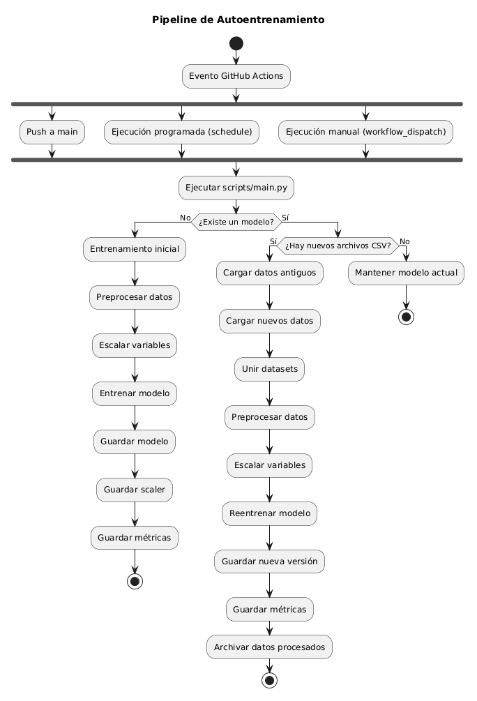

# Pipeline de Autoentrenamiento para Modelos de Machine Learning

Pipeline automatizado para el entrenamiento y reentrenamiento continuo de un modelo de clasificación de **Customer Churn** utilizando **Python**, **Scikit-learn** y **GitHub Actions**.

El proyecto simula un escenario de MLOps donde un modelo debe actualizarse automáticamente cuando llegan nuevos datos, almacenando cada versión del modelo y sus métricas para garantizar trazabilidad.

---

## Objetivo

Los modelos de Machine Learning pierden precisión con el tiempo debido a que el comportamiento de los datos cambia (Data Drift).

Este proyecto implementa un pipeline que automatiza el proceso de:

- Entrenamiento inicial.
- Detección de nuevos datos.
- Reentrenamiento del modelo.
- Versionado automático.
- Generación de métricas.
- Archivado de los datos procesados.

Todo el proceso puede ejecutarse automáticamente mediante **GitHub Actions**.

---
## Flujo del Pipeline

### 1. Disparador — GitHub Actions

El workflow `.github/workflows/pipeline.yml` se activa de dos formas:
- **Automática**: al hacer `push` a la rama `main`.
- **Programada**: diariamente a las 3:00 AM UTC (`cron: "0 3 * * *"`).
- **Manual**: desde la pestaña Actions con `workflow_dispatch`.

Ejecuta en un runner `ubuntu-latest`:
1. `actions/checkout@v4` — clona el repositorio.
2. `actions/setup-python@v5` — configura Python 3.13.
3. `pip install -r dependencias.txt` — instala pandas, scikit-learn, joblib.
4. `python scripts/main.py` — ejecuta el orquestador del pipeline.

### 2. Orquestador — `scripts/main.py`

`main.py` decide qué acción tomar según el estado del proyecto:

- **¿Existe un modelo?** Busca archivos `model_*.pkl` en `models/`.
  - Si **no existe** → ejecuta `scripts/entrenar.py` (entrenamiento inicial).
  - Si **existe** → revisa `data/new/` en busca de archivos `.csv`.
    - Si **hay nuevos datos** → ejecuta `scripts/reentrenar.py` (reentrenamiento).
    - Si **no hay nuevos datos** → no hace nada, mantiene el modelo actual.

### 3. División de datos — `scripts/dividirdatos.py`

Toma el dataset original `data/raw/Telco-Customer-Churn.csv` y lo divide:
- **80%** → `data/processed/initial_train.csv` (entrenamiento inicial).
- **20%** → `data/new/new_customers.csv` (simula llegada de nuevos clientes).

Esto se ejecuta una sola vez al inicio para preparar el escenario.

### 4. Preprocesamiento — `scripts/preparardatos.py`

`clean_data(df)` aplica las siguientes transformaciones:
- Elimina la columna `customerID`.
- Elimina espacios en blanco en nombres de columnas y valores string.
- Convierte `TotalCharges` de string a numérico (coerce errors).
- Si `TotalCharges` es NaN y `tenure == 0`, lo reemplaza con 0.0.
- Si quedan NaN, los rellena con `MonthlyCharges * tenure`.
- Elimina filas duplicadas.
- Verifica rangos válidos (tenure, MonthlyCharges, TotalCharges >= 0).
- Convierte `tenure` a int y `MonthlyCharges` a float.
- Redondea `TotalCharges` a 2 decimales.

`encode_features(X)` aplica **one-hot encoding** sobre todas las columnas categóricas (`drop_first=True`, `dtype=int`).

`encode_target(y)` convierte la variable objetivo `Churn` de `{"No", "Yes"}` a `{0, 1}`.

### 5. Entrenamiento inicial — `scripts/entrenar.py`

1. `create_version()` genera un identificador único: `v{numero}_{timestamp}` (ej: `v1_20260708_193443`).
2. Carga `data/processed/train_processed.csv`.
3. Separa features (`X`) y target (`y`).
4. Divide en 80% entrenamiento / 20% prueba (`train_test_split`, random_state=42).
5. Escala las columnas numéricas (`tenure`, `MonthlyCharges`, `TotalCharges`) con `StandardScaler` y guarda el scaler como `models/scaler_{version}.pkl`.
6. Entrena una **regresión logística** (`LogisticRegression(max_iter=2000, random_state=42)`).
7. Guarda el modelo como `models/model_{version}.pkl`.
8. Evalúa: accuracy, precision, recall, f1-score y matriz de confusión.
9. Guarda las métricas como `reports/metrics_{version}.json`.

### 6. Reentrenamiento — `scripts/reentrenar.py`

1. Genera una nueva versión con `create_version()`.
2. Carga los datos antiguos (`data/processed/initial_train.csv`) y los nuevos (`data/new/*.csv`).
3. Fusiona ambos datasets con `pd.concat`.
4. Aplica el mismo preprocesamiento que en el entrenamiento inicial (limpieza, encoding, escalado).
5. Entrena un nuevo modelo de regresión logística.
6. Guarda el nuevo modelo y scaler versionados.
7. Evalúa y guarda las métricas.
8. **Archiva** los archivos de `data/new/` moviéndolos a `data/archive/` (con timestamp si hay conflicto de nombres).

### 7. Versionado

Cada ejecución genera archivos con nomenclatura única:
- `models/model_v{version}_{timestamp}.pkl`
- `models/scaler_{version}_{timestamp}.pkl`
- `reports/metrics_{version}_{timestamp}.json`

El contador de versión se incrementa automáticamente según los archivos existentes en `models/`.

---
## Diagrama de Actividades del Pipeline de Autoentrenamiento



---
## Estructura del Proyecto

```
├── .github/workflows/pipeline.yml   # Workflow de GitHub Actions
├── data/
│   ├── archive/                      # Datos nuevos procesados (archivados)
│   ├── new/                          # Nuevos datos entrantes (CSV)
│   ├── processed/                    # Datos procesados (train)
│   └── raw/                          # Dataset original
├── models/                           # Modelos y scalers entrenados (.pkl)
├── reports/                          # Métricas de evaluación (.json)
├── scripts/
│   ├── main.py                       # Orquestador del pipeline
│   ├── entrenar.py                   # Entrenamiento inicial
│   ├── reentrenar.py                 # Reentrenamiento con nuevos datos
│   ├── preparardatos.py              # Limpieza y preprocesamiento
│   ├── dividirdatos.py               # División inicial del dataset
│   ├── entenderdatos.py              # Análisis exploratorio
│   ├── evaluar.py                    # Evaluación de modelo
│   └── utils.py                      # Funciones reutilizables
├── dependencias.txt                  # Dependencias del proyecto
└── README.md
```

## GitHub Actions

El workflow `.github/workflows/pipeline.yml` se ejecuta automáticamente al hacer push a la rama `main` o manualmente desde la pestaña Actions. Pasos:

1. Clona el repositorio
2. Configura Python 3.13
3. Instala dependencias (`pip install -r dependencias.txt`)
4. Ejecuta `python scripts/main.py`

## Ejecución Local

```bash
# Instalar dependencias
pip install -r dependencias.txt

# Dividir datos iniciales (80% train, 20% nuevos)
python scripts/dividirdatos.py

# Ejecutar el pipeline
python scripts/main.py
```
---

## Resultados

El pipeline genera automáticamente:

- Modelo entrenado
- Scaler
- Métricas de evaluación
- Versiones históricas
- Datos archivados

Todo el proceso se ejecuta sin intervención manual cuando se detectan nuevos datos.

## Decisiones de Diseño

Se eligió GitHub Actions porque permite automatizar el pipeline sin necesidad de mantener un servidor propio.

Se implementó un versionado automático de modelos para conservar un historial completo del entrenamiento y facilitar comparaciones o rollback.

Los datos procesados se mueven automáticamente a `data/archive` para evitar que sean utilizados nuevamente en futuros reentrenamientos.

---

## Dataset

[Telco Customer Churn](https://www.kaggle.com/datasets/blastchar/telco-customer-churn) — Datos de clientes de una compañía de telecomunicaciones, utilizado para predecir si un cliente abandonará el servicio.

# Modelo

Regresión logística con `scikit-learn`. Cada versión genera un nuevo archivo con formato `model_v{version}_{timestamp}.pkl` y sus métricas asociadas en `reports/`.


# Tecnologías

- Python 3.13
- Pandas
- NumPy
- Scikit-learn
- Joblib
- Git
- GitHub Actions

---

Luna Alejandra Jaimes Galarcio - Proyecto desarrollado como ejercicio práctico de automatización de pipelines de Machine Learning utilizando Scikit-learn y GitHub Actions.